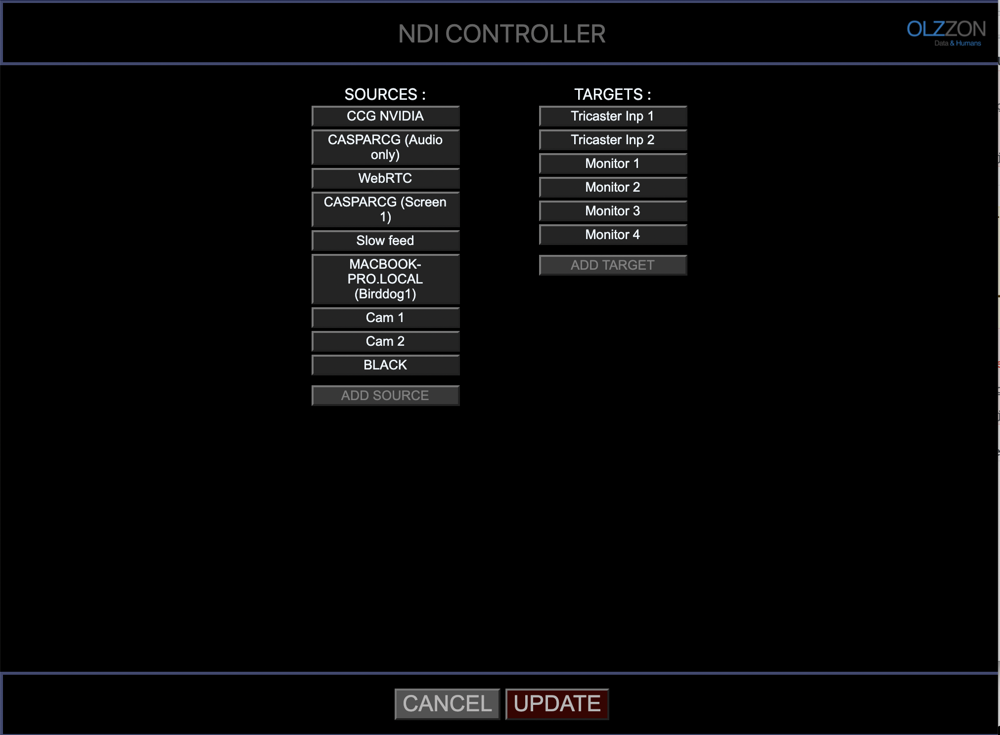
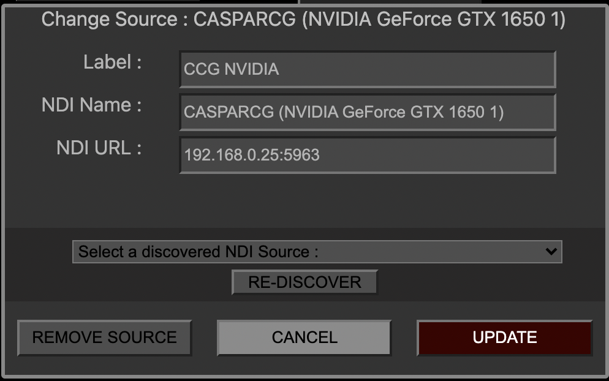
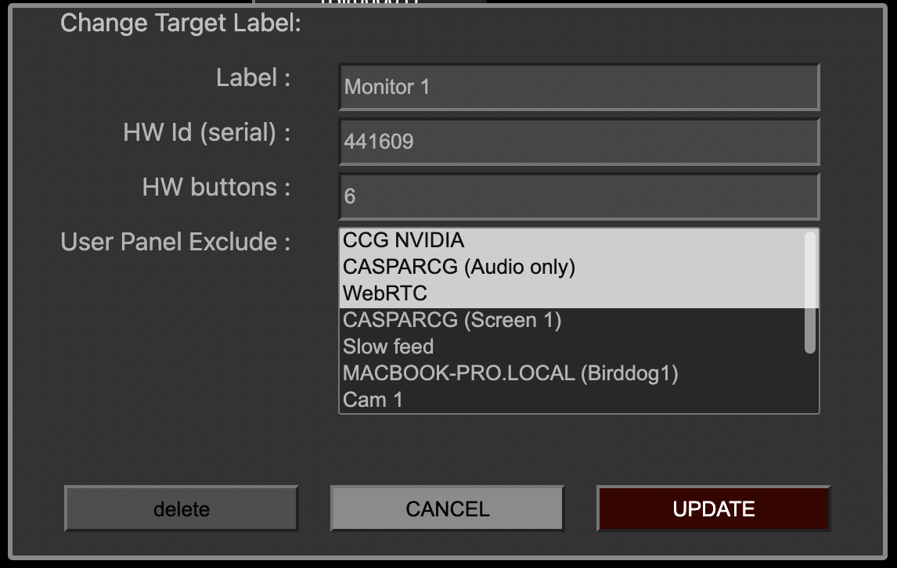

# NDI-CONTORLLER

The NDI Controller is a GUI based virtual NDI Matrix.
The NDI Controller creates virtual targets that you can select from your NDI Decoder (E.g. Tricaster or a Birddog)

In MTX SETUP you can add sources based on NDI discovery, or manually added sources, if you wan't a sources that in another sub-net.

There are 4 salvos (presets) for fast recalling a setup. You can store a prsset by press-and-hold the button for 0.6 sec.

It has support for external control by Ember supported software/hardware (e.g. VSM) 
And has a simple REST API for other external control. 

## Matrix view:


## Client Panel view:
If you open up a brower and type: 
```
localhost:5901/?target=3 (or whatever ip-address the NDI-Controller is located)
```
You'll get a personal source selector for a single target
In Mtx setup under targets you can select what sources that should be excludes for a specific target.


## MTX Setup view:


## Add source:
When adding a source you can either type in manually (e.g. adding a non-discoverable source) or select a discoveret NDI Source.
Pressing RE-DISCOVER will search for NDI sources again.


## Add Target:
When adding targets it's possible to assign a Skaarhoj HW panel + number of buttons, and exclude sources on User panels (Web client and Skaahoj panels)




## Installation: 
Windows: Run the pre-build "ndi-controller Setup x.x.x.exe"
Mac: Run the pre-build "ndi-controller-x.x.x.dmg"

## Skaarhoj panel support:
NDI Controller is listening for Skaahoj raw-panels on port 9923 (standard Skaahoj port)
In MTX settings -> you can add the serial number of the skaarhoj panel on the target you wish to control.

### Build and run:
(Ubutnu 20.04)

ndi_mtx.cc will build when yarn is called.
(c compiler on machine is needed)
```
apt-get update && apt-get install -y libavahi-common-dev libavahi-client-dev build-essential
clone and cd to ndi-ember-mtx folder
install nodejs v14 and yarn 
cp ./lib/x86_64-linux-gnu/* /usr/lib/
yarn
yarn build-server
yarn build-client
yarn start
```

Open Web control in chrome:
```
http://localhost:5901
```

Open CLIENT PANEL GUI in chrome:
```
http://localhost:5901/?target=2
```

Connect to Ember server on port: 9000

## REST API
You can change connections from REST API with:
```
POST http://localhost:5901/setmatrix?source=8&target=3
```

Recall a Salvo (preset)
```
POST http://localhost:5901/recall/?preset=2
```

Get the a JSON with current state, targetlabel and sourcelabel:
```
GET http://localhost:5901/state
```


Big thanks goes to Streampunk Media for Node-API c bindings inspiration

